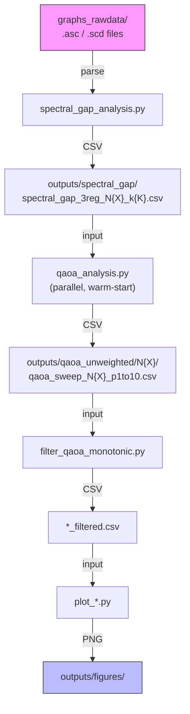

# QAOA Performance and Spectral Gap Analysis

Numerical analysis of the relationship between QAOA performance and the minimum spectral gap (Δ_min) for Max-Cut on regular graphs. The pipeline computes spectral gaps along the AQC interpolation path, runs QAOA sweeps across circuit depths, filters optimization artifacts, and generates publication-quality figures.

**Repository**: <https://github.com/eyal868/FinalQML>

---

## Architecture



**Or via the unified pipeline:**
```bash
python3 run_qaoa_pipeline.py --input outputs/spectral_gap/spectral_gap_3reg_N12_k2.csv --workers 8
```

---

## Quick Start

### Installation

```bash
pip3 install -r requirements.txt
```

### Option A: Unified Pipeline (Recommended)

```bash
python3 run_qaoa_pipeline.py \
    --input outputs/spectral_gap/spectral_gap_3reg_N12_k2.csv \
    --workers 8
```

### Option B: Step-by-Step

```bash
# 1. Compute spectral gaps
python3 spectral_gap_analysis.py

# 2. QAOA performance sweep
python3 qaoa_analysis.py

# 3. Filter optimization artifacts
python3 filter_qaoa_monotonic.py

# 4. Visualize
python3 plot_p_sweep_ratio_vs_gap.py outputs/qaoa_unweighted/N12/qaoa_sweep_N12_p1to10_filtered.csv
python3 plot_p_star_vs_gap.py outputs/qaoa_unweighted/N12/qaoa_sweep_N12_p1to10_filtered.csv
```

---

## Project Structure

```
FinalQML/
├── run_qaoa_pipeline.py               # Unified pipeline (all steps in one command)
│
│── spectral_gap_analysis.py           # Step 1: Compute Δ_min (sparse Lanczos + Brent)
│── qaoa_analysis.py                   # Step 2: QAOA p-sweep (parallel, warm-start)
│── filter_qaoa_monotonic.py           # Step 3: Monotonicity filter
│
│── plot_p_sweep_ratio_vs_gap.py       # Plot: ratio vs gap (multi-panel)
│── plot_p_star_vs_gap.py              # Plot: critical depth p* vs gap
│── plot_delta_vs_degeneracy.py        # Plot: gap vs degeneracy
│── plot_example_spectrum.py           # Plot: energy spectrum evolution
│── plot_optimization_failure_examples.py  # Plot: optimizer failure cases
│── plot_weighted_spectrum.py          # Plot: weighted Max-Cut spectrum
│── visualize_qaoa_single_graph.py     # Plot: single-graph QAOA behavior
│
│── aqc_spectral_utils.py             # Core: graph I/O, Hamiltonians, gap finding
│── qaoa_utils.py                     # Core: QAOA circuit helpers
│── output_config.py                  # Core: dual-save output path management
│
│── weighted_gap_analysis.py          # Weighted Max-Cut spectral gaps
│── sample_delta_uniform.py           # Uniform-sample graphs across gap bins
│── benchmark_optimizers.py           # Compare optimizers (COBYLA, SPSA, etc.)
│
├── tests/
│   ├── test_filter.py                # Monotonicity filter tests
│   ├── test_spectral_gap.py          # Spectral gap computation tests
│   └── test_scd_parser.py            # SCD binary format validation
│
├── graphs_rawdata/                   # GENREG graph enumerations
│   ├── 10_3_3.asc                    # 19 graphs, N=10, 3-regular (text)
│   ├── 10_4_3.asc                    # N=10, 4-regular (text)
│   ├── 10_5_3.asc                    # N=10, 5-regular (text)
│   ├── 12_3_3.asc                    # 85 graphs, N=12, 3-regular (text)
│   ├── 12_3_3.scd                    # 85 graphs, N=12, 3-regular (binary)
│   ├── 14_3_3.scd                    # N=14, 3-regular (binary)
│   ├── 16_3_3.scd                    # N=16, 3-regular (binary)
│   └── 18_3_3.scd                    # N=18, 3-regular (binary)
│
├── outputs/                          # All generated data & figures
│   ├── spectral_gap/                 # Spectral gap CSVs + gap-vs-degeneracy plots
│   ├── qaoa_unweighted/N{10,12,14,16}/  # QAOA sweep CSVs + plots per graph size
│   ├── qaoa_weighted/                # Weighted Max-Cut results
│   ├── figures/                      # Standalone publication figures
│   └── exploratory/                  # Test and experimental runs
│
├── docs/
│   └── paper_context.md              # Paper mapping and research context
│
├── requirements.txt
├── CHANGELOG.md
└── README.md                         # This file
```

---

## Script Reference

### Pipeline

| Script | Purpose | Key Options |
|--------|---------|-------------|
| `run_qaoa_pipeline.py` | Run full workflow in one command | `--input`, `--workers`, `--p-min/max`, `--degeneracy`, `--skip-qaoa/filter/plots` |

### Core Analysis

| Script | Purpose | Input | Output |
|--------|---------|-------|--------|
| `spectral_gap_analysis.py` | Compute Δ_min via sparse Lanczos + Brent optimization | `graphs_rawdata/*.asc/.scd` | `outputs/spectral_gap/spectral_gap_*.csv` |
| `qaoa_analysis.py` | QAOA p-sweep (p=1–10), COBYLA, warm-start, parallel | Spectral gap CSV | `outputs/qaoa_unweighted/N{X}/qaoa_sweep_*.csv` |
| `filter_qaoa_monotonic.py` | Remove non-monotonic points (optimizer failures) | QAOA sweep CSV | `*_filtered.csv` |
| `weighted_gap_analysis.py` | Spectral gaps for weighted Max-Cut | Graph files + weights | `outputs/qaoa_weighted/` |

### Visualization

| Script | Purpose |
|--------|---------|
| `plot_p_sweep_ratio_vs_gap.py` | Multi-panel: approximation ratio vs Δ_min at each depth |
| `plot_p_star_vs_gap.py` | Critical depth p* vs Δ_min for thresholds 0.75–0.95 |
| `plot_delta_vs_degeneracy.py` | Scatter: Δ_min vs ground state degeneracy |
| `plot_example_spectrum.py` | Full energy spectrum along s ∈ [0, 1] |
| `plot_optimization_failure_examples.py` | Publication figure of optimizer failure cases |
| `plot_weighted_spectrum.py` | Weighted Max-Cut spectrum evolution |
| `visualize_qaoa_single_graph.py` | Single-graph QAOA behavior (supports `--graph_id`, `--hardest`, `--easiest`) |

### Utilities

| Module | Purpose |
|--------|---------|
| `aqc_spectral_utils.py` | Graph I/O (ASC + SCD parsers), sparse Hamiltonian construction, gap finding |
| `qaoa_utils.py` | QAOA circuit helpers |
| `output_config.py` | Dual-save output management (see [Output System](#output-system)) |
| `sample_delta_uniform.py` | Uniform-sample graphs across spectral gap bins |
| `benchmark_optimizers.py` | Compare COBYLA, SPSA, L-BFGS-B, basin-hopping |

---

## Output System

All scripts use `output_config.py` for consistent output handling.

### Dual-Save Behavior

Every output is saved to **two locations**:

1. **Repo**: `outputs/{category}/` — CSVs are git-tracked; PNGs are gitignored
2. **Desktop**: `~/Desktop/FinalQML_Outputs/YYYY-MM-DD/{experiment}_{HHMMSS}/` — timestamped snapshots

### Usage

```python
from output_config import get_run_dirs, save_dual, save_run_info

repo_dir, desktop_dir = get_run_dirs("qaoa_unweighted/N12")
save_dual(df, repo_dir / "qaoa_sweep_N12_p1to10.csv", "qaoa_unweighted/N12")
save_run_info(desktop_dir, "qaoa_unweighted/N12")
```

### Naming Conventions

| Category | Pattern | Example |
|----------|---------|---------|
| Spectral gap | `spectral_gap_{deg}reg_N{size}_k{degeneracy}.csv` | `spectral_gap_3reg_N12_k2.csv` |
| QAOA sweep | `qaoa_sweep_N{size}_p{min}to{max}.csv` | `qaoa_sweep_N12_p1to10.csv` |
| Filtered | `{original}_filtered.csv` | `qaoa_sweep_N12_p1to10_filtered.csv` |

---

## Data Files

### Graph Inputs (`graphs_rawdata/`)

| File | N | Degree | Count | Format |
|------|---|--------|-------|--------|
| `10_3_3.asc` | 10 | 3-regular | 19 | text |
| `10_4_3.asc` | 10 | 4-regular | — | text |
| `10_5_3.asc` | 10 | 5-regular | — | text |
| `12_3_3.asc` | 12 | 3-regular | 85 | text |
| `12_3_3.scd` | 12 | 3-regular | 85 | binary |
| `14_3_3.scd` | 14 | 3-regular | 509 | binary |
| `16_3_3.scd` | 16 | 3-regular | 4060+ | binary |
| `18_3_3.scd` | 18 | 3-regular | — | binary |

Both `.asc` (text) and `.scd` (binary, differential-compressed) formats are supported. `load_graphs_from_file()` in `aqc_spectral_utils.py` auto-detects format from the file extension.

### Current Datasets

| Size | Status | Spectral Gap | QAOA Sweep |
|------|--------|--------------|------------|
| N=10 | Fully analyzed | `spectral_gap_3reg_N10_k2.csv` | `outputs/qaoa_unweighted/N10/` |
| N=12 | Fully analyzed (k=2: 31, k=4: 26 graphs) | `spectral_gap_3reg_N12_k2.csv` | `outputs/qaoa_unweighted/N12/` |
| N=14 | Spectral gaps computed, QAOA feasible | `spectral_gap_3reg_N14_k2.csv` | `outputs/qaoa_unweighted/N14/` |
| N=16 | 100 uniform-sampled, spectral gaps computed | `spectral_gap_3reg_N16_uniform100.csv` | `outputs/qaoa_unweighted/N16/` |

---

## Testing

```bash
# Run all tests
pytest tests/

# Individual test files
pytest tests/test_filter.py          # Monotonicity filter
pytest tests/test_spectral_gap.py    # Spectral gap computation
pytest tests/test_scd_parser.py      # SCD binary parser validation
```

---

## Development Standards

### Configuration

All user-configurable parameters live at the top of each script in a `CONFIG` dict. Output filenames are auto-generated from configuration.

### Data Quality Checklist

- [ ] Degeneracy controlled (analyze k=2, k=4 separately)
- [ ] Both filtered and unfiltered versions generated
- [ ] Complete metadata (Δ_min, s_min, degeneracy, max_cut) in CSVs
- [ ] Reproducible (fixed seed 42, documented config)
- [ ] Publication-quality figures (300 DPI, r/p-value/n shown)

### QAOA Parameters

| Parameter | Value |
|-----------|-------|
| Circuit depths | p = 1–10 |
| Optimizer | COBYLA, max 500 iterations |
| Simulator | Qiskit Aer statevector (noiseless) |
| Random seed | 42 |
| Initialization | Heuristic (p=1) + warm-start (p≥2) + multi-start (p≥7, 3 attempts) |

---

**Last Updated:** February 24, 2026